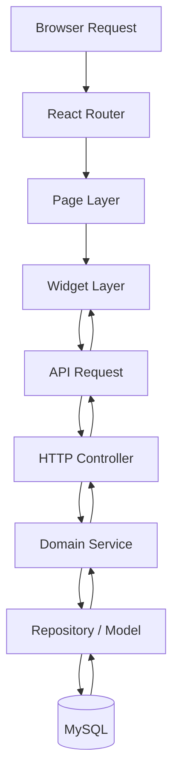

# TaskForge Enterprise

TaskForge Enterprise is an enterprise-inspired task and project management platform built as a portfolio-grade full-stack monorepo. The project focuses on scalable code organization, clear domain boundaries, AI-assisted planning, KPI visibility, and audit-ready system design.

This repository is designed to show how I structure a production-oriented application, not just a single demo page.

## Portfolio Highlights
- Monorepo setup with shared contracts for frontend and backend
- Domain-oriented Express API with clear module boundaries
- React frontend organized by app, pages, widgets, and shared layers
- AI planning, dashboard, employee, project, and task modules
- Architecture documentation covering API design, ERD, RBAC, KPI, and delivery risks
- Docker-based local infrastructure for MySQL and Redis

## Tech Stack

| Layer | Technology |
| --- | --- |
| Frontend | React 18, TypeScript, Vite, Tailwind CSS, Framer Motion, React Router |
| Backend | Node.js, Express, TypeScript, Sequelize, Zod |
| Shared Contracts | TypeScript workspace package |
| Database | MySQL 8 |
| Queue / Cache | Redis, BullMQ |
| Auth / Security | JWT, bcrypt, Helmet, CORS |
| Tooling | npm workspaces, Docker Compose |

## Architecture Overview

```mermaid
flowchart LR
    U[User / Browser] --> W[React SPA]
    W --> C[@taskforge/contracts]
    W --> A[Express API]
    A --> C
    A --> M[Domain Modules]
    M --> DB[(MySQL)]
    M --> R[(Redis / BullMQ)]
    M --> S[(S3-compatible storage)]
    M --> AI[AI Provider]
```

## Request Flow



## Repository Structure

```text
.
├── apps
│   ├── api
│   │   ├── src
│   │   │   ├── app
│   │   │   ├── bootstrap
│   │   │   ├── config
│   │   │   ├── infrastructure
│   │   │   ├── modules
│   │   │   └── shared
│   └── web
│       ├── src
│       │   ├── app
│       │   ├── pages
│       │   ├── shared
│       │   └── widgets
├── packages
│   └── contracts
└── docs
```

## Folder Guide

### Backend: `apps/api/src`
- `app/`: express app assembly and route registration
- `bootstrap/`: server startup and runtime bootstrap
- `config/`: environment configuration
- `infrastructure/`: database and logging wiring
- `modules/`: business domains such as auth, employees, projects, tasks, ai, dashboard
- `shared/`: cross-cutting HTTP helpers, middleware, error types, and utilities

### Frontend: `apps/web/src`
- `app/`: app shell and router
- `pages/`: route-level screens
- `widgets/`: larger UI sections used by pages
- `shared/`: config, styling, utilities, primitive UI, and mock data

### Shared package: `packages/contracts`
- shared constants
- workflow definitions
- permission codes
- transport-safe API types

## Implemented Modules

### API
- Health
- Auth
- Employees
- Projects
- Tasks
- AI
- Dashboard

### Frontend
- Dashboard route
- App shell layout
- Dashboard widgets
- Shared UI primitives

## Documentation
- [System Architecture](docs/02-system-architecture.md)
- [Database ERD](docs/03-database-erd.md)
- [RBAC and Security](docs/04-rbac-security.md)
- [Workflow Design](docs/05-workflow-design.md)
- [AI Planner Design](docs/06-ai-planner.md)
- [KPI Analytics](docs/07-kpi-analytics.md)
- [API Design](docs/08-api-design.md)
- [Frontend Experience](docs/09-frontend-experience.md)
- [Codebase Structure](docs/14-codebase-structure.md)

## Quick Start

1. Copy `.env.example` to `.env`
2. Start MySQL and Redis with `docker compose up -d`
3. Install dependencies with `npm install`
4. Run type checks with `npm run typecheck`
5. Start the API with `npm run dev:api`
6. Start the web app with `npm run dev:web`

## Useful Commands

```bash
npm run dev
npm run dev:api
npm run dev:web
npm run build
npm run typecheck
docker compose up -d
```

## Notes
- `.env.example` is configured to use MySQL on port `3307` when running through Docker Compose.
- The current frontend demonstrates the dashboard experience and shared UI structure.
- The codebase is intentionally organized for scale, team ownership, and future feature expansion.

## Why This Project Exists

I built this repository to demonstrate how I approach full-stack application architecture for a business-oriented product:
- designing a maintainable monorepo
- separating domain logic from transport concerns
- preparing for AI-assisted workflows and analytics
- documenting tradeoffs, risks, and delivery strategy

For a recruiter or hiring team, this repo is meant to show both implementation ability and engineering judgment.
# todolist
