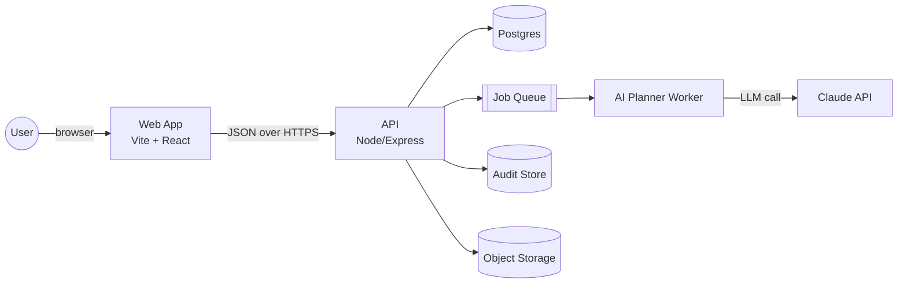
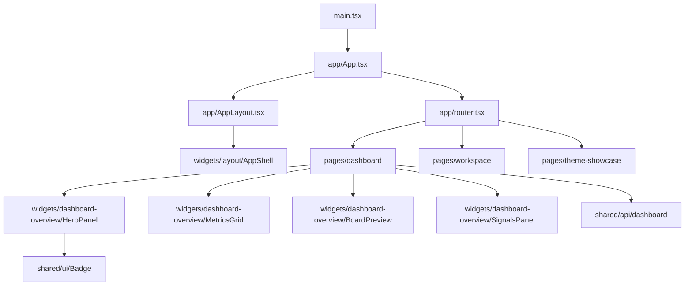
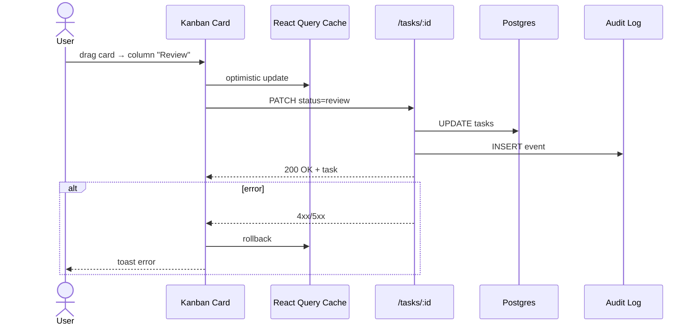
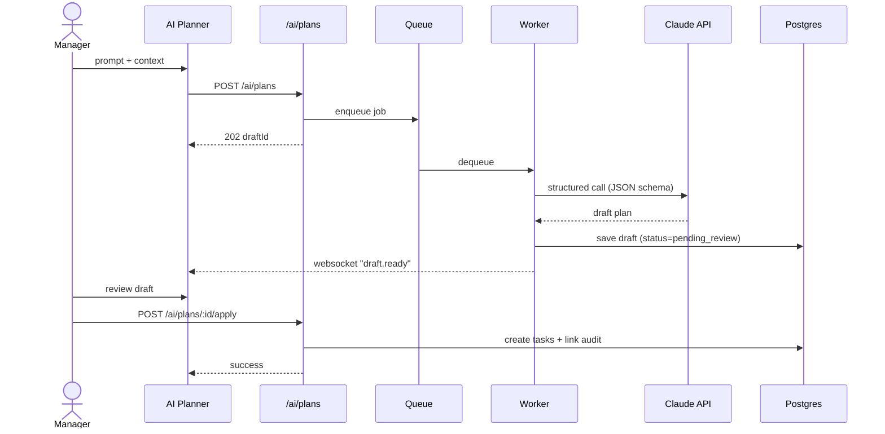
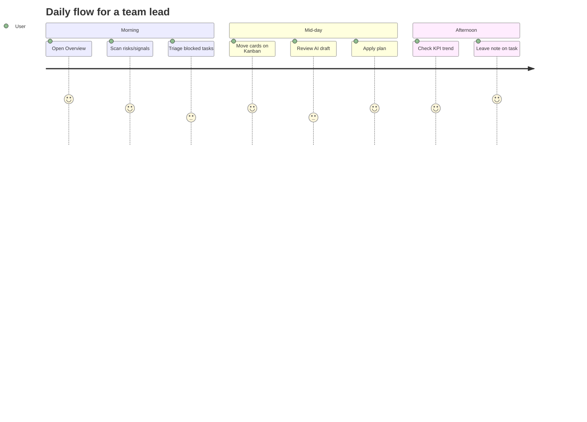
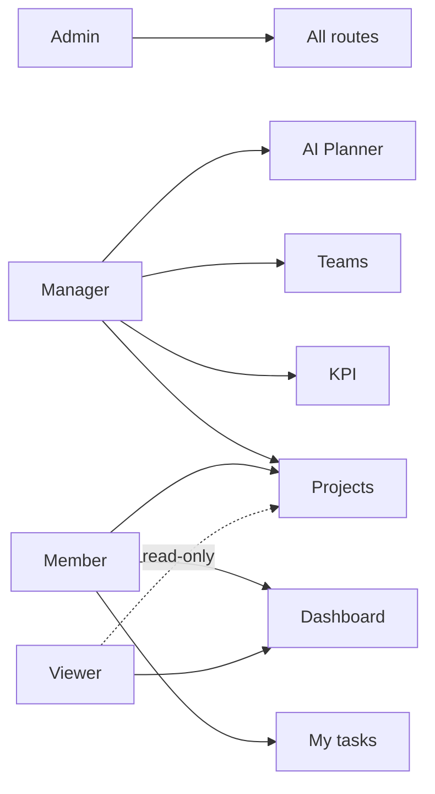
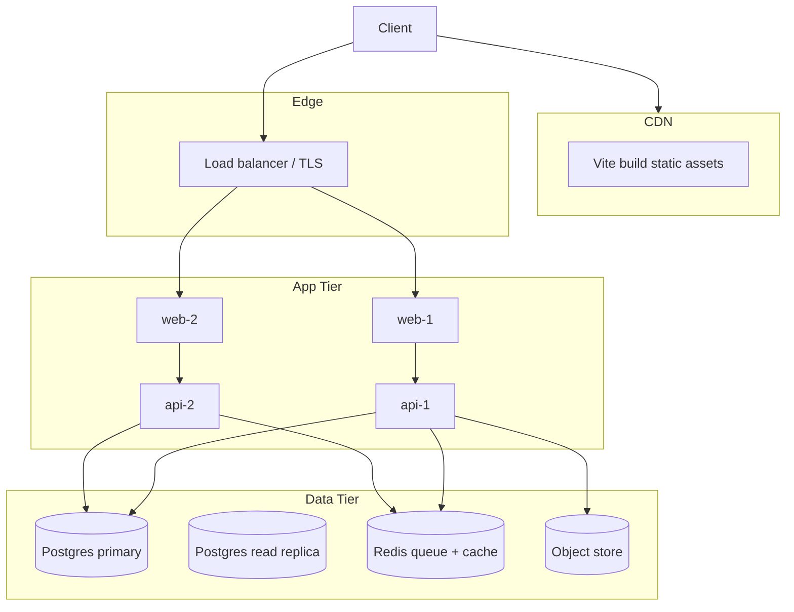

# Graphs & Diagrams

Graph รวมสำหรับ architecture / data flow / user journey — ใช้ Mermaid (render ได้ใน GitHub + VS Code)

## 1. System context

## 2. Frontend module graph

## 3. Data flow — Task update

## 4. AI Planner flow

## 5. User journey — Daily operator

## 6. Role & permission graph

## 7. Deployment topology

