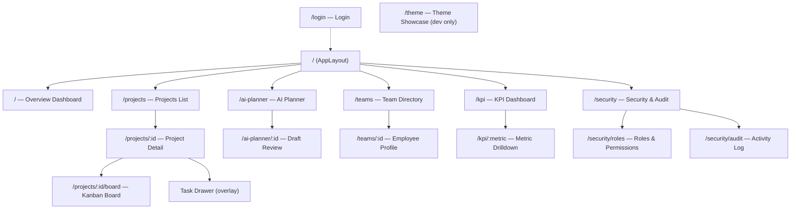
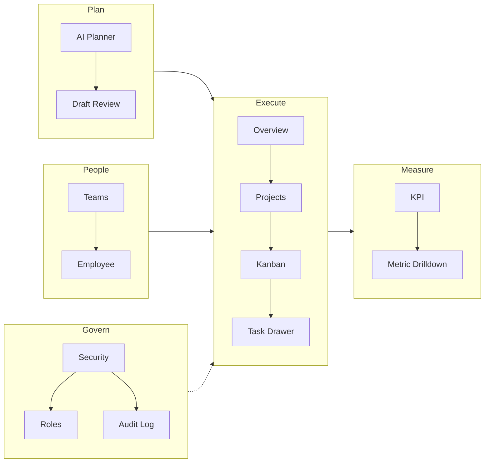

# Sitemap

โครงสร้าง route ของ web app ทั้งหมด ใช้อ้างอิงเวลาเพิ่ม/ย้ายหน้า

## Route tree

## Route inventory

| Path | Page | Widget หลัก | Role ที่เข้าถึงได้ |
| --- | --- | --- | --- |
| `/login` | Login | AuthPanel | public |
| `/` | Dashboard Overview | HeroPanel, MetricsGrid, BoardPreview, SignalsPanel | member+ |
| `/projects` | Projects List | ProjectTable, FilterBar | member+ |
| `/projects/:id` | Project Detail | MilestoneTrack, TeamPanel, RiskBadge | member+ |
| `/projects/:id/board` | Kanban Board | KanbanLanes, TaskCard, DragOverlay | member+ |
| `/ai-planner` | AI Planner | PromptPanel, DraftList | manager+ |
| `/ai-planner/:id` | Draft Review | PlanTimeline, RiskSummary, ApplyBar | manager+ |
| `/teams` | Team Directory | PeopleGrid, CapacityStrip | manager+ |
| `/teams/:id` | Employee Profile | WorkloadChart, HistoryFeed | manager+ |
| `/kpi` | KPI Dashboard | TrendWall, IndicatorCards | manager+ |
| `/kpi/:metric` | Metric Drilldown | TimeseriesChart, Breakdown | manager+ |
| `/security` | Security Hub | AuditSummary, RoleMatrix | admin only |
| `/security/roles` | Roles & Permissions | PermissionMatrix | admin only |
| `/security/audit` | Audit Log | EventTimeline, FilterRail | admin only |

## Information architecture (IA)

